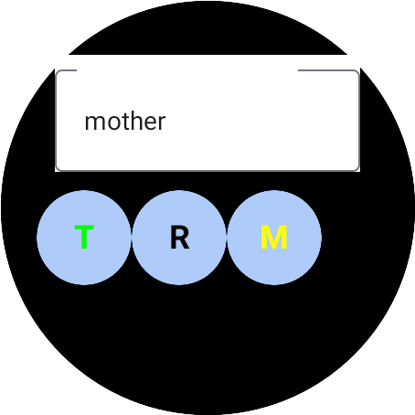

   <h1 align="Center"> Assistant Translator  from English to Spanish </h1>
   <h1 align="Center">  Galaxy Watch5 Pro </h1>

   

This project  and  GPT-ChatApp represent the culmination of the concepts and techniques covered in our book, bringing together various components to create a powerful AI Assistant application. As technology continues to advance, AI assistants play an increasingly significant role in our lives, offering assistance with tasks ranging from information retrieval to task automation. With GPT-ChatApp, we aim to showcase the potential of integrating UI design, data management, and conversational capabilities to create an intelligent and versatile AI assistant.
      
   

<h2>To use this code.</h2>

Get your OpenAI API's key first and Go Model package inside GPTApi and replace  

<pre>
    <code>
 interface GPTApi {
    @Headers(
        "Content-Type: application/json",
        "Authorization: Bearer "Your OpenAI key here"
    )
    @POST("/v1/completions")
    fun getCompletion(
        @Body requestBody: GPTReq
    ): Call<GPTRes>
}
    </code>
</pre>

  
  
  

